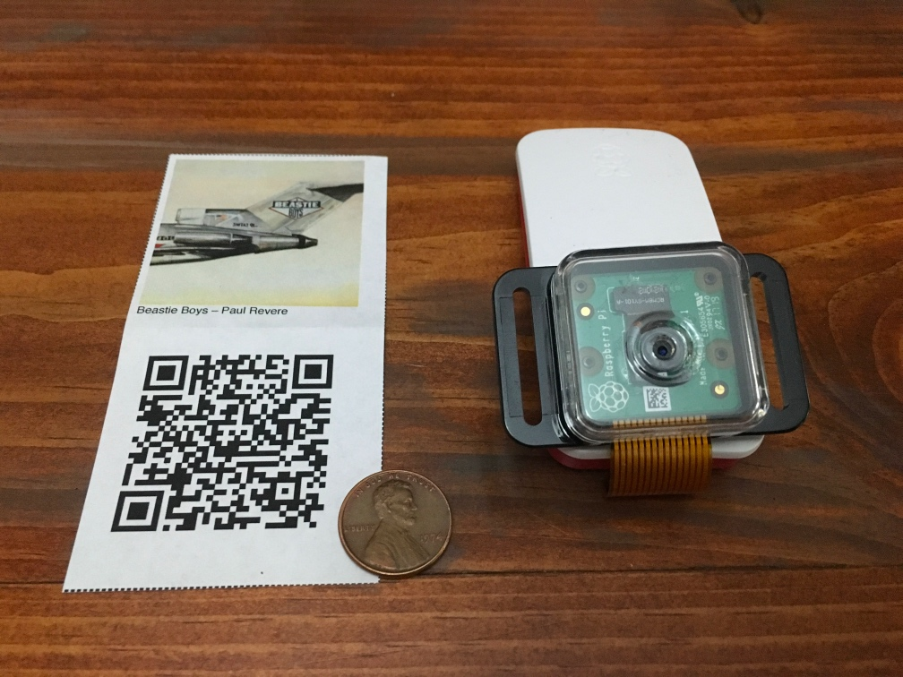

# qqqr: QR code music player



Ever wished you had physical albums for all your cloud music? Tired of carrying a dozen milk crates full of vinyl records up and down stairs when you move?

qqqr is a Raspberry Pi Zero W project which uses ZBar and OpenCV to read paper QR code cards encoding Google Play Music track IDs and play the songs over a Bluetooth speaker.

Project status: abandoned. Everything worked. But I found out that I can use the Spotify app to scan [Spotify Codes](https://www.spotifycodes.com/index.html), so I decided not to put more time into polishing qqqr.

Fair warning: if you go on an archaeological dig in the code, you'll see that I tried `mplayer`, `mpg321`, and `mopidy` for playback. I found that all of them took about 10 - 30 seconds to start playing from Google Play Music after the track ID was identified, whether streaming or pre-caching. I'm sure there's a solution but I didn't dig very deeply. My workaround solution was to use [Spotify Connect](https://www.spotify.com/us/connect/) for playback instead of local playback from Google Play Music.

## Raspberry Pi config

#### Wi-Fi config

https://learn.adafruit.com/raspberry-pi-zero-creation/text-file-editing

#### Raspberry PI hardware RNG

(Fixes "getrandom() initialization failed" error)

`sudo apt install rng-tools`

## Camera focal length adjustment

#### video stream preview (2-3 second lag)
https://raspberrypi.stackexchange.com/a/71680  
`raspivid -t 0 -l -o tcp://0.0.0.0:3333`  
`/Applications/VLC.app/Contents/MacOS/VLC tcp/h264://qqpi.lan:3333`  

#### focal length adjustment
(counter-clockwise is closer focal length)
https://www.jeffgeerling.com/blog/2017/fixing-blurry-focus-on-some-raspberry-pi-camera-v2-models  
(optional) https://www.adafruit.com/product/3519  


## OpenCV installation

#### OpenCV SD card image

SD card image with precompiled OpenCV binaries

https://medium.com/@rosbots/ready-to-use-image-raspbian-stretch-ros-opencv-324d6f8dcd96

https://github.com/ROSbots/rosbots_setup_tools#use-our-existing-rosbots-raspbianrosopencv-image-after-youve-downloaded-it

#### Compiling OpenCV

Instructions for compiling OpenCV on Raspberry Pi. (Turned out this takes 24+ hours on Raspberry Pi Zero so I gave up and used the ROSbots SD card image above.)

https://www.pyimagesearch.com/2018/09/26/install-opencv-4-on-your-raspberry-pi/

## QR code scanning

https://www.pyimagesearch.com/2018/05/21/an-opencv-barcode-and-qr-code-scanner-with-zbar/

## Bluetooth speaker

#### Pairing Bluetooth speaker

https://www.sigmdel.ca/michel/ha/rpi/bluetooth_01_en.html  

https://gist.github.com/actuino/9548329d1bba6663a63886067af5e4cb  

#### Reconnect Bluetooth speaker

```
bluetoothctl -a
connect C0:28:8D:02:8D:8E
quit
```

#### Play a test wav

```
aplay -D bluealsa:HCI=hci0,DEV=C0:28:8D:02:8D:8E,PROFILE=a2dp /usr/share/sounds/alsa/Front_Center.wav
```

#### Configure `.asoundrc`

```
pi@qqpi:~ $ cat .asoundrc
defaults.bluealsa.interface "hci0"
defaults.bluealsa.device "C0:28:8D:02:8D:8E"
defaults.bluealsa.profile "a2dp"
```

#### Auto-connect Bluetooth speaker

https://raspberrypi.stackexchange.com/a/53456
https://raspberrypi.stackexchange.com/a/53745

## streaming mp3 playback

#### mplayer

https://www.raspberrypi.org/forums/viewtopic.php?t=189323

## Mopidy installation and playback
(no longer using Mopidy—see explanation at top of page)

#### mopidy installation

```
sudo apt remove python-pip
wget -q https://bootstrap.pypa.io/get-pip.py
sudo python get-pip.py

sudo apt-get install python-dev libxml2-dev libxslt1-dev zlib1g-dev
sudo apt-get install python-lxml
pip install mopidy-gmusic
sudo pip install mopidy-gmusic --ignore-installed pyasn1 --ignore-installed lxml
```

#### mopidy config

```
pi@qqpi:~ $ vi ~/.config/mopidy/mopidy.conf
[audio]
#mixer = software
#mixer_volume =
output = alsasink device = bluealsa
#buffer_time =

[http]
#enabled = true
#hostname = 127.0.0.1
hostname = ::

[local]
#enabled = true
#library = json
media_dir = /home/pi/bluetooth_audio
```

#### control via mpd client

```
mpc add local:track:Untitled3.wav && mpc repeat && mpc play
mpc ls 'Google Music/Albums/The Grateful Dead - 5-8-77'
mpc add gmusic:track:7649c1b0-9499-36ef-bfe4-4f2a121ac08a && mpc play
```
